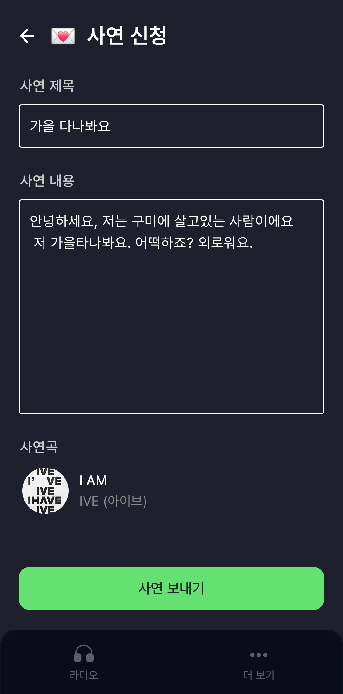

## 👨‍👨‍👦‍👦 FM 404.NotFound 팀 소개  
| 이상철 | 이철민 | 박동현 |
| --- | --- | --- |
| Team Leader | Android Tech Leader | DevOps |
|  |  |  |
| [@Harvey-sc-Lee](https://github.com/Harvey-sc-Lee) | [@rlatpwls30](https://github.com/tpwls30) | [@jinee9523](https://github.com/pdh9523) |

| 김범중 | 김의근 | 허동원 |
| --- | --- | --- |
| Backend Tech Leader | Backend Developer | Backend Developer |
|  |  |  |
| [@bbamjoong](https://github.com/bbamjoong) | [@ramen4598](https://github.com/ramen4598) | [@heo_dongwon](https://github.com/dongwon99) |

# 📷 프로젝트 소개

**언제 어디서나**✋ **내 손안의 AI DJ, On AiR**

### **📝 언제 어디서나 나에게 맞춤형 DJ**

> OnAiR에서 취향에 맞는 DJ 라디오 채널을 만들어 보세요.
>
> 기다릴 필요 없이 터치 몇 번이면 원하는 라디오 방송을 들을 수 있어요!

### **👬 성격, 목소리, 플레이리스트까지 모두 커스터마이징**

> DJ의 성향, 컨텐츠 내용까지 모두 설정해보세요
> 
> 성격을 설정하면 각종 컨텐츠를 성격에 맞추어서 읽어줘요!

# 🔧 기술 스택

  
Android

  | Android | Version |
  | --- | --- |
  | Android Studio | 2024.1.1 |
  | Android min SDK | 30 |
  | Android target SDK | 34 |
  | Android max SDK | 34 |

  
Backend

  | Backend | Version |
  | --- | --- |
  | OpenJDK | 17.0.12 |
  | Spring Boot | 3.3.5 |
  | Spring Data JPA | 3.3.3 |
  | JUnit5 | 5.10.3 |
  | MySQL | 8.4.1 |
  | FastAPI | 0.115.4 |
  | python | 3.12.5 |
  | FastAPI | 0.115.4 |
  | Langchain | 0.2.15 | 

  
CI/CD

  | CI/CD | Version |
  | --- | --- |
  | Jenkins | jenkins/jenkins:2.462.3-jdk17 |
  | Docker | 27.3.1 |
  | Docker Compose | 2.29.7 |
  | Nginx | 1.27 |
  | Nginx-prometheus-exporter | 1.3 |
  | mysqld-exporter | 0.16.0 |
  | prometheus | 3.0.0 |
  | node-exporter | 1.8.2 |
  | alertmanager | 0.28.0 |
  | grafana | 11.3.0-security-01-ubuntu |
  | confluentinc/cp-kafka | 7.4.0 |
  | confluentinc/cp-zookeeper | 7.4.0 |
  | ELK Stack | 8.15.3 | 

# 🏗️ 서비스 아키텍처

# 방송 처리 과정   

# **✨  주요 기능**

### 💵 커스텀 DJ 채널을 생성해보세요
성격, 목소리, 주제, 플레이 리스트를 선정하여 본인의 입맛에 맞는 채널을 생성해 보세요    
  

### 💵 AI DJ에게 사연을 보내보세요
설정한 성격에 따라 사연을 읽어주고 대답을 해줍니다.

### 📱작동 화면
| 1. 회원가입 | 2. 마이페이지 | 3. 채널 생성 | 4. 방송 참가 |
|---|---|---|---|
|전화번호 인증이 필수입니다.|프로필, 닉네임을 변경할 수 있어요|본인의 입맛에 맞게 바꿔보세요|라디오 채널에 참여해보세요|
|||||

| 5. 사연 전송 | 6. 사연 |7. 날씨 | 8. 뉴스 | 9. 노래 |
|---|---|---|---|---|
|사연을 보낼 수 있어요|사연이 채택되면 DJ가 읽어줘요|날씨를 읽어줘요|뉴스를 읽어줘요|플레이리스트에서 노래를 틀어줘요|
||||  ||

# 🔨 기술 소개

## ➡️ MockMvcTest

### 도입 이유

- 테스트에 필요한 기능만 가지는 가짜 객체를 만들어서 애플리케이션 서버에 배포하지 않고도 스프링 MVC 동작을 재현할 수 있어 도입했습니다.
- Request → Response의 API 호출 과정을 테스트할 수 있어 API 연결 시 발생할 수 있는 오류를 최소화 할 수 있도록 하였습니다.

### 도입 결과

- **테스트 속도 향상**: 실제 서버를 배포하지 않고도 API 호출 과정을 재현함으로써 빠르게 테스트할 수 있었습니다. 이를 통해 개발 주기를 단축해 프로젝트 완성도를 높일 수 있었습니다.
- **API 통신 오류 사전 예방**: MockMvc를 사용하여 Request-Response 흐름을 테스트한 결과, 실제 배포 환경에서 발생할 수 있는 API 통신 오류를 사전에 식별하고 해결할 수 있었습니다. 덕분에 배포 후 발생할 수 있는 문제를 줄일 수 있었습니다.
- **통합 테스트 비용 절감**: 모든 레이어를 통합하는 방식이 아닌, 필요한 컨트롤러 및 서비스 레이어만을 독립적으로 테스트할 수 있어 통합 테스트에 소요되는 리소스를 절감할 수 있었습니다.

## ➡️ Spring Security, JWT

### 도입 이유
- 접근 제어를 쉽게 구현할 수 있어, 인증(Authentication)과 인가(Authorization)를 관리하기 위해 도입했습니다.
- Security의 FilterChain에 직접 구현한 Filter를 배치해 보안을 강화할 수 있도록 하였습니다.

### 도입 결과
- **보안성 강화**: 인증 및 인가 과정이 Spring Security로 일관성 있게 처리됨으로써, RBAC(Roll-Based-Access-Control)을 통한 API에 대한 무단 접근을 방지할 수 있었습니다.
- **XSS와 CSRF 공격 방지**: XSS 공격을 방지하기 위해 Access Token은 로컬 스토리지에 저장했고, Refresh Token은 httpOnly 옵션을 적용한 쿠키에 저장하여 브라우저 스크립트에서 접근할 수 없도록 했습니다. Refresh Token은 오직 토큰 재발급 기능만 수행하게 하여, CSRF 공격에 취약할 수 있음을 인지하면서도 피해 범위를 최소화할 수 있었습니다.
- **JWT 복제 공격 방지**: 로그아웃 시, JWT가 복제되는 것을 방지하기 위해 생명주기가 긴 Refresh Token을 서버 측에서 관리하였습니다. 이를 통해 사용자의 Request가 들어올 때마다 서버에서 토큰의 유효성을 검증하고, 서버가 인증의 주도권을 가지는 구조로 개선하였습니다.
- **Refresh Token의 Rotate 전략**: Access Token이 만료될 때 Refresh Token도 함께 재발급하는 'Rotate' 기능을 도입했습니다. 이를 통해 Refresh Token이 탈취되었을 경우 피해를 줄일 수 있었고, 비록 두 토큰의 생명주기가 동일해지는 단점이 있지만 보안성을 향상시키는 데 기여했습니다.

## ➡️ Jetpack Compose

### 도입 이유

- 기존 XML기반 레이아웃 시스템에 비해 더 직관적이고 간결한 코드 작성이 가능합니다.
- 상태 변경에 따른 UI업데이트가 자동으로 이루어져, 기존의 복잡한 UI로직 처리를 간소화 시킬 수 있습니다.
- 필요한 UI요소만 다시 그리는 효율적인 렌더링 방식을 사용하여 앱의 성능을 최적화하고자 했습니다.

### 도입 결과

- **코드 양 감소**: 기존 XML 레이아웃 대비 30~50% 정도의 코드 줄 수를 감소 시킬 수 있었습니다.
- **재사용 가능한 컴포넌트**: 커스텀 UI요소를 쉽게 만들고 재사용할 수 있어, 앱 전반의 UI 일관성을 향상 시킬 수 있었습니다.
- **메모리 사용량 감소 및 렌더링 성능 향상**: 효율적인 컴포지션 시스템으로 메모리 사용량을 최적화 시킬 수 있었고, 필요한 부분만 다시 그리는 방식으로 UI업데이트 성능을 향상 시킬 수 있었습니다.

## ➡️ 멀티모듈

### 도입 이유

- 팀 단위 작업에서 각 개발자가 특정 모듈에 집중하여 개발할 수 있어 협업 효율성을 높일 수 있다.
- 각 모듈이 특정 기능에 집중하므로 코드의 응집도가 높아지고 모듈 간 의존성을 명확히 정의하여 의존성 규칙 위반을 방지할 수 있습니다.
- 새로운 기능을 개발할 때 기존 코드를 수정하지 않고 새 모듈을 만들어 추가 및 모듈 단위로 코드를 수정하고 관리할 수 있어 유지보수가 용이합니다.

### 도입 결과

- **코드 재사용성 향상** : 기능별로 모듈을 나누어 개발하면 필요한 기능을 다른 프로젝트에서 쉽게 재사용할 수 있습니다.
- **의존성 관리 개선** :  각 모듈의 build.gradle 파일에서 의존성을 명확히 정의함으로써 의존성 규칙 위반을 방지할 수 있습니다.
- **팀 협업 효율성 증대** : 각 팀이나 개발자가 특정 모듈에 집중하여 개발할 수 있었고, 새로운 기능을 추가할 때 기존 코드를 수정하지 않아서 효율성을 높일 수 있었음.

## ➡️ Hilt

### 도입 이유

- Dagger의 복잡한 보일러플레이트 코드를 줄이고 더 간단한 DI 구현이 가능합니다.
- Android 생명주기에 맞춘 컴포넌트들을 자동으로 관리해주어 메모리 누수를 방지할 수 있습니다.
- 표준화된 DI 패턴을 제공하여 팀 전체가 일관된 방식으로 의존성 주입을 구현할 수 있습니다.

### 도입 결과

- **코드 간소화**: Dagger 대비 설정 코드가 30% 정도 감소하여 개발 생산성이 향상되었습니다.
- **안정성 향상**: Android 생명주기와 통합된 의존성 관리로 메모리 누수와 같은 런타임 에러가 감소했습니다.
- **테스트 용이성**: 테스트용 의존성을 쉽게 교체할 수 있어 단위 테스트 작성이 더욱 편리해졌습니다.
- **유지보수성 개선**: 표준화된 DI 패턴으로 인해 코드의 일관성이 높아지고 새로운 팀원의 온보딩이 쉬워졌습니다.

## ➡️ ProGuard

### 도입 이유

- 앱 크기를 최적화하여 사용자의 다운로드 시간과 저장공간 사용을 줄일 수 있습니다.
- 코드 난독화를 통해 리버스 엔지니어링으로부터 앱을 보호할 수 있습니다.
- 사용하지 않는 코드와 리소스를 제거하여 앱의 성능을 향상시킬 수 있습니다.
- 앱의 메모리 사용량을 최적화하여 더 효율적인 리소스 관리가 가능합니다.

### 도입 결과

- **앱 크기 감소**: 평균적으로 20~40% 정도의 앱 크기 감소 효과를 얻을 수 있었습니다.
- **보안성 강화**: 코드 난독화를 통해 앱의 내부 로직을 보호하고 무단 복제나 해킹 시도를 어렵게 만들었습니다.
- **성능 최적화**: 불필요한 코드 제거로 앱 시작 시간이 개선되고 전반적인 성능이 향상되었습니다.
- **메모리 사용량 감소**: 사용하지 않는 클래스와 메서드 제거로 런타임 메모리 사용량이 최적화되었습니다.

## ➡️ HLS 프로토콜

### 도입 이유

- 음성 콘텐츠 스트리밍 서비스 필요성
- 동적 채널 관리 : 사용자들이 직접 채널을 생성하고 관리할 수 있도록 하는 기능이 요구되었습니다.

### 도입 결과

- **스트리밍**: 안정적은 음성 콘텐츠 스트리밍이 가능했습니다. 또한 자체 로깅으로 효율적인 디버깅을 할 수 있었습니다.
- **동적 채널 관리**: 동적 채널 관리에 성공하여 유저가 채널을 생성하면 그에 따라 스트림이 생성되고, 일정 시간이 지나면 삭제되어 정리되었습니다.

## ➡️ Kafka

### 도입 이유

- 서버 간 동기적 통신의 높은 결합도와 복잡성을 해결하고 확장성과 가용성을 확보하기 위해 Apache Kafka를 도입했습니다.

### 도입 결과

- **서버 고가용성 및 안정성**: Kafka를 통해 비동기 통신을 구현하여 시스템의 유연성, 안정성, 및 성능을 크게 향상시켰습니다.

## ➡️ Langchain

### 도입 이유

- LLM을 활용한 서비스를 빠르게 구현하기 위해서 LangChain을 도입하였습니다.

### 도입 결과

- **Json 파싱 문제 해결**: LLM의 응답을 JSON 파싱 문제를 해결하기 위해 PydanticOutputParser와 OutputFixingParser를 적용해 응답의 형식을 검증하고 자동으로 수정했습니다.

## ➡️ ELK Stack & prometheus + grafana

### 도입 이유

- ELK 스택은 유저 로그 분석 및 최적화 시도에 활용했습니다.
- Prometheus와 Grafana는 시스템 및 데이터베이스 매트릭 모니터링 및 시각화에 사용합니다.

### 도입 결과

- **모니터링 환경**: 모니터링 및 경고 시스템 도입으로 서버 상태를 실시간으로 추적하며 안정적인 환경을 구축했습니다.
- **보안 위협 사전 감지**: 시스템 부하 문제를 해결하고 잠재적인 보안 위협을 사전에 감지했습니다.

# 📚💻 개발 문서

  
📋✨ 기능 정의서

  
  

  
🗂️ ERD (Entity Relationship Diagram)

  
  

  
👣 유저 플로우 (User Flow)

  
  

  
🖼️ 와이어프레임 (Wireframe)

  
  

  
 📊 시퀀스 다이어그램 (Sequence Diagram)

  

    
 📻 방송생성 

    
  

  

    
 🎧 AI DJ 방송 진행 

    
  

  

    
 📰 🌡️ 라디오 컨텐츠 생성 

    
  

  

    
 💌 사연 생성 

    
  

  

    
 ❌ 방송 종료 

    
  

## 🙆 협업 방식

### **🙌 적극적인 의사소통**

### Mattermost

- 어려운 문제로 개발이 지연될 때 적극적으로 팀원들에게 도움을 요청하여 문제를 해결하고, 빠르게 개발을 진행할 수 있도록 했습니다. 문제 해결 과정을 투명하게 공유하며 팀의 협업을 원활하게 유지했습니다.

### Discord

- Discord의 원격 소통 및 화면 공유 기능을 활용해 팀원들과 긴밀히 협업 했습니다. 실시간 피드백을 통해 문제를 빠르게 해결하고, 원활한 의사소통으로 프로젝트의 효율성을 높였습니다.

### Jira

- Jira를 통해 프로젝트 이슈를 체계적으로 관리하며, 작업 진행 상황을 팀원들과 공유했습니다. 스프린트 계획을 수립하고, 우선순위를 설정해 프로젝트 목표를 명확히 해 협업의 효율을 높였습니다.

### 코드 컨벤션

- 구글 코딩 컨벤션을 참고한 우아한 테크코스(우테코) 컨벤션을 바탕으로 코드 컨벤션을 유지했습니다. 일관된 컨벤션으로 협업을 수월하게 진행할 수 있었습니다.

> [우아한 테크코스 코드 컨벤션](https://github.com/woowacourse/woowacourse-docs/blob/main/styleguide/java/intellij-java-wooteco-style.xml)

### Notion

- 프로젝트 전반에 대한 내용과 공통 자료를 Notion을 통해 관리하며, 체계적인 정보 공유와 문서화를 실천했습니다.
    - 명세서, 코드 컨벤션, 공유 자료, API 정의서, 환경변수 등을 문서화하여 모든 팀원이 쉽게 접근할 수 있도록 했습니다.
