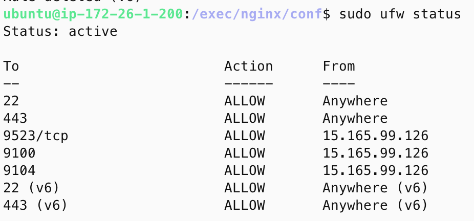

# 포팅 매뉴얼

폴더 구성

```
exec

-- main
---- cert
---- db
---- elk
------ setup
------ elasticsearch
------ kibana
------ logstash
------ extensions
-------- filebeat
---- kafka
------ conf
---- log
------ conf
---- nginx
------ conf
---- onair

-- sub
---- cert
---- jenkins
---- log
------ conf
------- alert
---- nginx
------ conf
```

## 아키텍쳐 구성도


## 메인 인스턴스 구성

각 기능의 설정은, main 디렉터리 내부에 해당하는 디렉터리로 이동하여 실행한다.

1. cert 설정
    
    `docker-compose -f cert-compose.yaml up -d` 
    
    명령어 실행 후, certbot 폴더 내부 인증서 생성 확인
    
    확인이 되었다면,
    
    `docker-compose -f cert-compose.yaml down`
    
    명령어 실행
    
2. db 설정
    
    내부에 `MYSQL_ROOT_PASSWORD` , `MYSQL_USER` ,`MYSQL_PASSWORD` 등을 설정한 `.env` 파일을 위치 시킨 후,
    
    `docker-compsoe -f db-compose.yaml up -d`
    
    명령어 실행
    
3. ELK stack 설정
    
    public template을 참고하여 구성
    
    [https://github.com/deviantony/docker-elk](https://github.com/deviantony/docker-elk)
    
    `docker-compose -f elk-compose.yaml up setup` 
    
    으로 setup이 완료된 것을 확인한 후,
    
    `docker-compose -f elk-compose.yaml up -d` 
    
    명령어 실행
    
4. kafka 설정
    
    `docker-compose -f kafka-compose.yaml up -d` 
    
    명령어 실행
    
5. log 설정
    
    `docker-compose -f log-compose.yaml up -d` 
    
    명령어 실행
    
6. 메인 서비스 onair 설정
    
    내부에 서버와 관련된 환경변수를 정의한 `.env` 파일을 위치 시킨 후,
    
    `docker-compose -f onair-compose.yaml up -d` 
    
    명령어 실행
    

## 추가 인스턴스 구성

각 기능의 설정은, sub 디렉터리 내부에 해당하는 디렉터리로  이동하여 실행한다.

1. cert 설정
    
    `docker-compsoe -f cert-compose.yaml up -d`
    
    명령어 실행 후, certbot 폴더 내부 인증서 생성 확인
    
    확인이 되었다면,
    
    `docker-compsoe -f cert-compose.yaml down`
    
2. jenkins 설정
    
    `docker-compose -f jenkins-compose.yaml up -d`
    
    명령어 실행
    
3. log 설정
    
    `docker-compose -f log-compose.yaml up -d`
    
    명령어 실행
    
4. nginx 설정
    
    `docker-compsoe -f nginx-compose.yaml up -d`
    

## 각 서비스에 대한 설명

1. cert: 인증서 발급을 통한 nginx 내 https 통신 설정
2. db: MySQL로, 서비스 데이터 저장을 위함
3. kafka: 서비스 간 통신을 위함
4. prometheus: exporter들이 생산한 데이터를 가공 및 모니터링
5. node exporter: 시스템 매트릭 데이터 수집을 위함
6. nginx exporter: nginx의 매트릭 데이터 수집을 위함
7. mysqld exporter: db의 매트릭 데이터 수집을 위함
8. alertmanager: 프로메테우스에서 수집한 데이터를 기반으로 규칙을 설정하고 경고를 전달
9. grafana: prometheus에서 수집한 데이터를 시각화
10. elk: 로그 모니터링 시스템
11. nginx: 리서브 프록시 설정을 위함
12. jenkins: 빌드 자동화를 위함

## 메인 인스턴스와 추가 인스턴스 간 통신 설정

- iptables
    
    
    
    ```bash
    # 1. DOCKER-USER 체인 생성 (이미 존재할 경우 오류 방지를 위해 무시)
    sudo iptables -N DOCKER-USER 2>/dev/null
    
    # 2. 기본 정책 설정
    sudo iptables -P DOCKER-USER ACCEPT
    
    # 3. 특정 IP에서 포트 9104로의 접속 허용
    sudo iptables -A DOCKER-USER -p tcp -s 15.165.99.126 --dport 9104 -j ACCEPT
    
    # 4. 포트 9104로의 다른 모든 트래픽 차단
    sudo iptables -A DOCKER-USER -p tcp --dport 9104 -j DROP
    
    # 5. 특정 IP에서 포트 9100으로의 접속 허용
    sudo iptables -A DOCKER-USER -p tcp -s 15.165.99.126 --dport 9100 -j ACCEPT
    
    # 6. 포트 9100으로의 다른 모든 트래픽 차단
    sudo iptables -A DOCKER-USER -p tcp --dport 9100 -j DROP
    
    # 7. 특정 IP에서 포트 3306으로의 접속 허용
    sudo iptables -A DOCKER-USER -p tcp -s 15.165.99.126 --dport 3306 -j ACCEPT
    
    # 8. 포트 3306으로의 다른 모든 트래픽 차단
    sudo iptables -A DOCKER-USER -p tcp --dport 3306 -j DROP
    
    # 9. 모든 트래픽을 RETURN (기본적으로 체인을 종료)
    sudo iptables -A DOCKER-USER -j RETURN
    
    ```
    
- ufw
    
    
    
    ```bash
    # 1. ufw 활성화
    sudo ufw enable
    # 2. 22 포트와 443 포트 개방
    sudo ufw allow 22
    sudo ufw allow 443
    # 3. 9523, 9100, 9104 포트 추가 인스턴스에만 개방
    sudo ufw allow from 15.165.99.126 to any port 9523 proto tcp
    sudo ufw allow from 15.165.99.126 to any port 9100
    sudo ufw allow from 15.165.99.126 to any port 9104
    ```
    

## 버전

### Android

### Backend

### CI / CD

ubuntu - v22.04.5 LTS

Docker - v27.3.1

Docker Compose - v2.29.7

nginx  - v1.27

nginx-prometheus-exporter - v1.3

jenkins - v2.462.3

MySQL - v8.4.3

mysqld-exporter -v.0.16.0

prometheus - v3.0.0

node-exporter - v1.8.2

alertmanager - v0.28.0

grafana - v11.3.0-securirty-01-ubuntu

confluentinc/cp-kafka - v7.4.0

confluentinc/cp-zookeeper - v7.4.0

ELK Stack - v8.15.3

### 외부 서비스

1. Chat GPT
2. TypeCast TTS